🌐 **中文** · [English](README.en.md)

> _「说一句话，拿回一个能持续出片的 AI 角色。」_

[](LICENSE)
[](https://skills.sh/)
[](assets/index.json)

**在你的 agent 里说一句"做个 AI 网红"，拿回一套能直接进短视频生产线的角色资产包。**

设计原创、缩略图一眼可辨、可持续出片的 AI 网红 / 虚拟博主 / UGC 角色：
三句人设 → 170 项形象分类数据（3 档夸张度）→ 全身定妆图 → EDIT 保脸修改 →
8 格角色设定表 → 场景首帧 → 交接包。内置规则引擎校验、视觉打分门禁（G1–G4）、
验收报告与自进化账本。

核心信条：**先写人，再出脸** —— 一个招牌发型 + 一个突出特征 + 老派真诚着装 +
全程面无表情；缩略图辨识 > 精致度；锁定参考后一切以它为准；原创，绝不借脸。

[看效果](#-画廊) · [安装](#装上就能用) · [能做什么](#能做什么) · [工作流](#s0s8-阶段门禁) · [仓库结构](#仓库结构)

---

## 🎨 画廊

### 角色案例 · Showcase

<table>
<tr>
<td width="280">
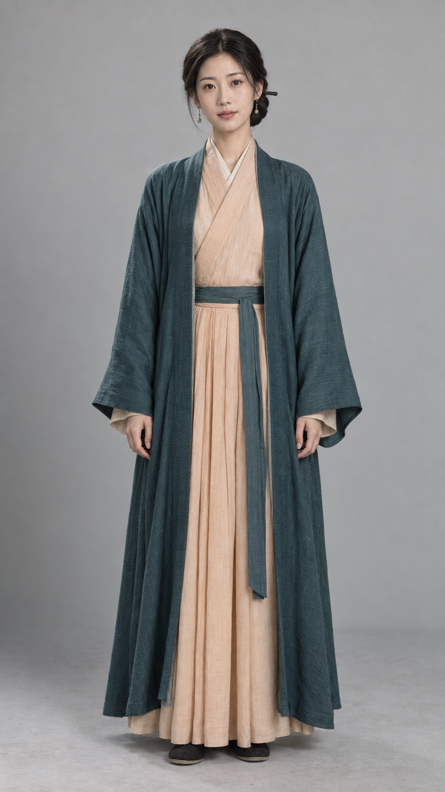
</td>
<td valign="top">

**姜令仪 · jiang-lingyi** —— 架空古装权谋短剧女主

- 三句人设：边境小国 26 岁和亲公主，入京议亲；用婚约与外交谈判换取停战、
  运粮与边民生存；她相信个人体面可以让步，百姓性命不是筹码。
- 招牌：黑色中分低盘辫髻 + 浅绿小玉耳坠 + 黛青长衫配杏色交领；
  左袖藏一袋故乡种子（不举在手里）。
- 招牌梗：受压时先理平袖口，再用平稳语气问回被回避的问题。
- 定妆图 G2 评分 **4.37 / 5**（一次通过）。

</td>
</tr>
</table>

更多角色案例见 [gallery/README.md](gallery/README.md)。

### 元素画廊 · 170 项形象分类

18 个类目 × 170 个选项，每个元素一张独立单图（禁止拼图）——
发型 26 款（含蜂巢头、灯罩头、螺旋卷、台阶头等招牌款）、面部特征 25 项、
肤色 8 档、风格 8 系。三档夸张度：Average / Bold / Extreme。

👉 **[完整画廊 · gallery/taxonomy.md](gallery/taxonomy.md)**（自动生成，可检索）

<table>
<tr>
<td>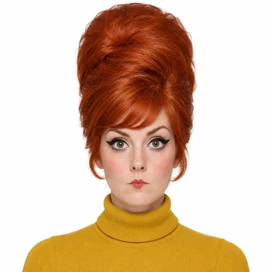<br><sub>蜂巢髻</sub></td>
<td>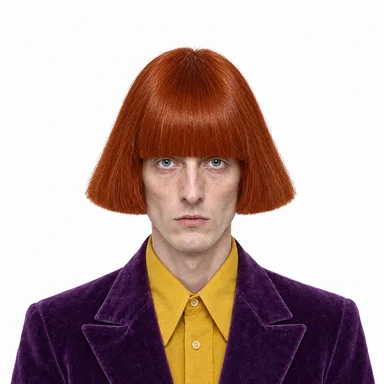<br><sub>灯罩头</sub></td>
<td>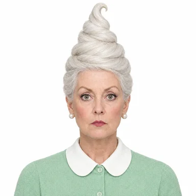<br><sub>冰淇淋卷</sub></td>
<td>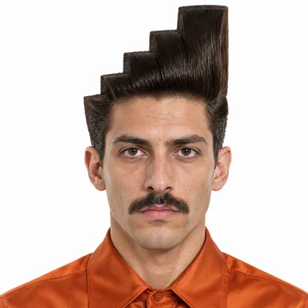<br><sub>台阶头</sub></td>
<td>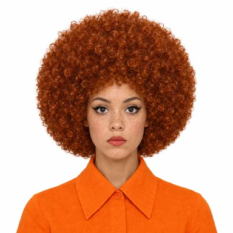<br><sub>球型发</sub></td>
<td>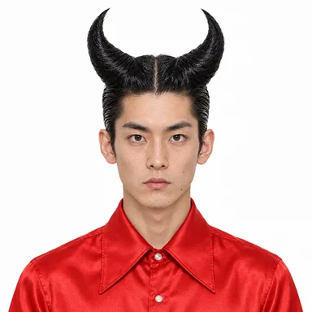<br><sub>双角髻</sub></td>
</tr>
<tr>
<td>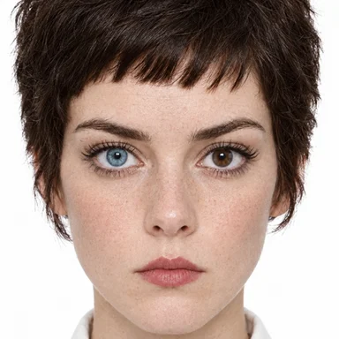<br><sub>异色瞳</sub></td>
<td>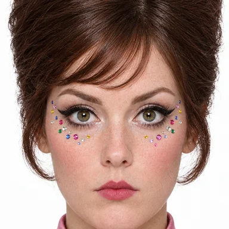<br><sub>面部宝石</sub></td>
<td>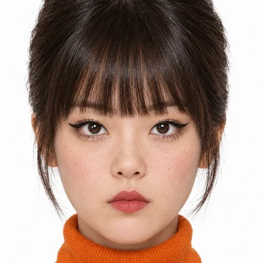<br><sub>夸张鼻 1</sub></td>
<td>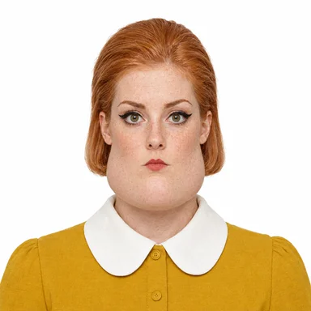<br><sub>巨型下巴</sub></td>
<td>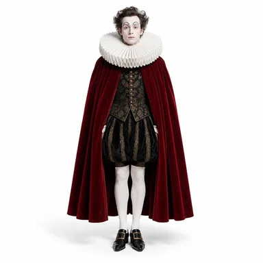<br><sub>戏剧风</sub></td>
<td>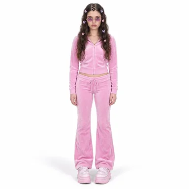<br><sub>Y2K</sub></td>
</tr>
</table>

---

## 装上就能用

这是一个标准的 agent skill（含 `SKILL.md` + `assets/` + `data/` + `references/` +
`scripts/` + `templates/` + `evolution/` 子目录，缺一不可）。克隆到任意 skills 目录：

```bash
git clone https://github.com/laozhong86/ugc-character-designer.git \
  ~/.agents/skills/ugc-character-designer      # 或你的 agent skills 目录
```

然后在支持 skills 的 agent 里直接说话：

```
「帮我做一个 AI 网红」
「随机捏脸 3 个，我要做 TikTok 宠物吐槽账号」
「基于这个定妆图做 8 格角色设定表」
「把这个角色的发型换成蜂巢髻，脸不要变」
```

运行依赖：Python 3.10+（脚本无第三方依赖）；出图需要任意文生图通道
（OmniMux hub / gpt-image / 即梦 / Nano Banana 均可，`references/generation-tools.md`）。

---

## 能做什么

| 能力 | 交付物 | 门禁 |
|---|---|---|
| 随机捏脸 | 3 个候选角色（人设 + 全身图 + prompt） | 用户选 1 |
| 分层自定义捏脸 | L1–L6 六层锁定（性别→族裔→轮廓→五官→发型→风格），上层锁定自动过滤下层 | 每层确认 |
| 角色卡 | `character.json`（bio×3 / vibe / 招牌 / 动作人格 / 漂移护栏 / 原创性声明） | **G1** |
| 全身定妆图 | 9:16 定妆图 + 视觉打分 | **G2 ≥3.8** |
| EDIT 保脸修改 | 只改一处、其余逐字锁定的重跑 | identity ≥4 |
| 8 格设定表 | 16:9 设定表（5 全身 + 3 特写） | **G3 ≥4.0** |
| 场景首帧 | 1–3 张 9:16 UGC 首帧，验证换场景仍是同一人 | **G4** |
| 交接包 | 视频动作迁移所需的全部锚点 + acceptance.md | 全绿 |
| 自进化 | 失败模式汇总 → 经验规则 promote 进 `evolution/learnings.md` | ≥2 证据 run |

## S0→S8 阶段门禁

```
S0 捏脸 ─→ S1 概念 ─→ S2 角色卡 ─→ S3 全身定妆 ─→ S4 EDIT ─→ S5 锁定
                                                              │
S8 交付 ←─ G4 场景 ←─ G3 设定表 ←─────────────────────────────┘
```

- **分数只来自亲眼看到的生成图**——逐项对照 `data/qa-rubric.json`，绝不凭 prompt 打分。
- 失败必须打 `failure_tags`（rubric 内置修复建议），下一次按建议改 prompt，禁止原样重跑。
- 每阶段最多 3 次不同尝试，仍不过 → 向用户说明卡点与选项，不假装完成。

## 核心机制

### 数据驱动，不默认本土化

对话用中文 ≠ 角色是中国人。族裔、风格、档位来自用户回答或数据内置随机权重；
未指定时概念必须覆盖多种族裔（`ugc_taxonomy.py diversity --market global` 硬门禁）。

### 单元素图协议

170 个选项每个一张独立 webp 参考图（`assets/options/<category>/<id>.webp`），
展示与参考一律逐张单图，**禁止拼图/联系表**——拼图会让模型在出图时混入错误元素。

### 锁定即宪法

定妆图通过后 `ugc_lab.py lock`，最终 CHARACTER 段落写进 `character.json`；
之后所有出图（设定表/场景/EDIT）都以它为身份锚点，修改只能走 EDIT 流程。

### 自进化账本

每次生成 `ugc_lab.py log` → 看图 → `score`；交付 `accept`；复盘 `evolve` 汇总失败模式，
经用户同意以 ≥2 个证据 run `promote` 进 `evolution/learnings.md`——
skill 会越用越准。

## 硬约束

- **原创**：不做真人/名人/网红/版权角色的相似形象；要求"像某某" → 婉拒并提供原创替代。
- 幽默来自造型、姿态、态度；绝不嘲弄种族、身材、性别认同、背景。
- 不承诺收益；平台激励条款以官方为准。

## 脚本速查

```bash
S=scripts
python3 $S/ugc_face.py random --count 3 --slug <slug>     # 随机捏脸 → prompt + 生图参数
python3 $S/ugc_face.py init|menu|apply|prompt --state <face-state.json> --layer L1..L6
python3 $S/ugc_taxonomy.py find "horn" | get hair/hs_horns | refs --sel @sel.json
python3 $S/ugc_taxonomy.py diversity --tier freak --sels '[s1,s2,s3]' --market global
python3 $S/ugc_lab.py init|card-check|log|score|lock|accept|evolve|promote
python3 $S/build_gallery.py   # 重建 gallery/taxonomy.md
python3 $S/selftest_all.py    # 改动 skill 后的回归（必须全绿）
```

## 仓库结构

```
ugc-character-designer/
├── SKILL.md                # 主文档（给 agent 读）：S0–S8 阶段门禁
├── README.md / README.en.md
├── assets/
│   ├── index.json          # 170 条元素索引（label/fragment/look/tier/单图路径）
│   └── options/<cat>/<id>.webp   # 170 张单元素图 + 6 张档位图
├── data/                   # taxonomy.json / 视觉描述 / 中文标签 / QA rubric / 规则
├── references/             # 方法论蒸馏 / 捏脸题库 / 生图工具坑 / 原文证据
├── scripts/                # ugc_face.py / ugc_taxonomy.py / ugc_lab.py / build_gallery.py
├── templates/              # 角色卡模板 / prompt 模板库 T1–T7
├── evolution/              # learnings.md（已证实规则）+ ledger.jsonl（账本）
└── gallery/                # 展示画廊：角色案例 + taxonomy.md 元素全览
```

## Limitations

- **出图质量取决于文生图通道**：multi-reference 一致性编辑在多数网关仍是 draft；
  当前用"逐字 CHARACTER 段 + 文生图"保脸，极端情况下跨图一致性会漂。
- **不做真人相似**：任何"做得像某明星/某网红"的请求都会被拒绝并转原创替代。
- 8 格设定表对极端档位（Extreme）角色的跨格一致性仍是难点，可能需要 2–3 次迭代。

这是一个让"AI 角色"从一次性图片变成可持续生产资产的 skill——
角色负责差异，格式负责分发。

## License

[MIT](LICENSE) — 自由使用、修改、分发，包括商业用途。
