# 画廊 · Gallery

四个区：**产出案例**（本 skill 真实出图）· **行业对标**（外部参考图）· **视频案例**（Jean Phil 事件）· **元素画廊**（170 项 taxonomy 单图索引）。

---

## 视频案例 · Jean Phil 事件与本 skill 的背景

> 完整拆解 → **[case-study-jean-phil.md](case-study-jean-phil.md)**
> （BuBBliK《How to Make Your First $1,000,000 with AI》分析 + 爆款规律 + 与本 skill 公式的对照）

Jean Phil（金发翘胡 + 薰衣草西装 + "Oui Madame"）9 月底两周内单条最高 36M 播放，
衍生 token 手续费收入约 $235K；随后 Derek Mercer（遮眼黑发 + 肌肉）以相反轮廓
复制爆发，Higgsfield 官方下场——AI 角色成为新的创作者范式。视频为原作者素材，仅作研究存档。

| 视频 | 播放 | 看点 |
|---|---|---|
| [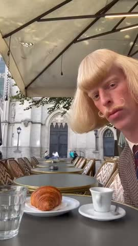](videos/jeanphil-oui-madame-5.4M.mp4) | 5.4M | 破圈之作：招牌口癖 "Oui Madame" |
| [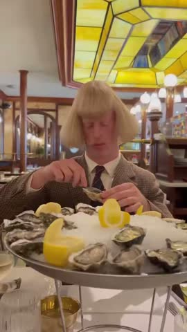](videos/jeanphil-double-g-3.7M.mp4) | 3.7M | 品牌梗植入：日常场景复用公式 |
| [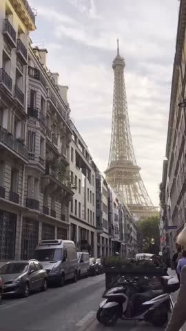](videos/jeanphil-tour-eiffel.mp4) | 290K | 地标场景：换场景仍是同一人 |
| [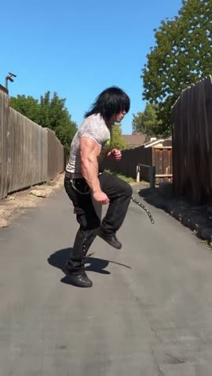](videos/derekmercer-feelings-off-bass-on.mp4) | 对手角色 | "Feelings off. Bass on." 极简人设 |
| [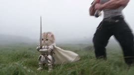](videos/higgsfield-ai-influencer-announce.mp4) | 3.2M | 平台官方下场：「平台放大」实锤 |

---

## 产出案例 · `characters/`

本 skill 验收通过的角色。每个角色一组文件：`<slug>-fullbody.png`（定妆图）、
`<slug>-sheet.png`（8 格设定表）、`<slug>-scene-*.png`（场景首帧）。

| 角色 | 定妆 | 赛道 | 档位 | G2 评分 |
|---|---|---|---|---|
| [姜令仪 jiang-lingyi](characters/jiang-lingyi-fullbody.png) |  | 架空古装权谋短剧 | Average | 4.37 |

> 新角色验收后把图拷到这里并登记本表。

---

## 行业对标 · `references/`

外部优秀 AI influencer 的角色设定表与定妆图（Higgsfield AI Influencer 等，via X）。
**非本 skill 产出**——收集目的是校准目标水位：什么样的设定表才算"缩略图一眼可辨"。
来源归原作者所有，仅作研究参考。

### 8 格设定表对标（5 全身 + 3 特写，同一角色多角度）

| | | |
|---|---|---|
| 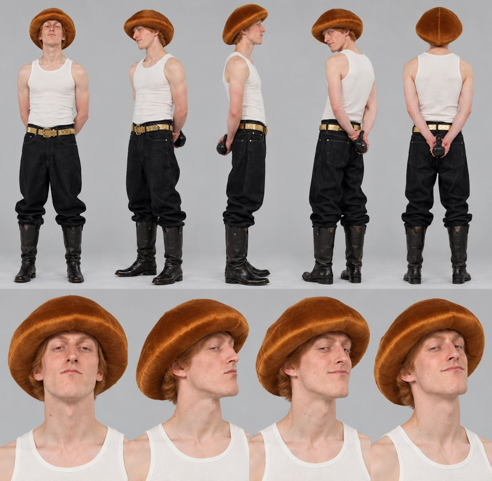 蘑菇帽 + 背心马靴：招牌发型极简化 | 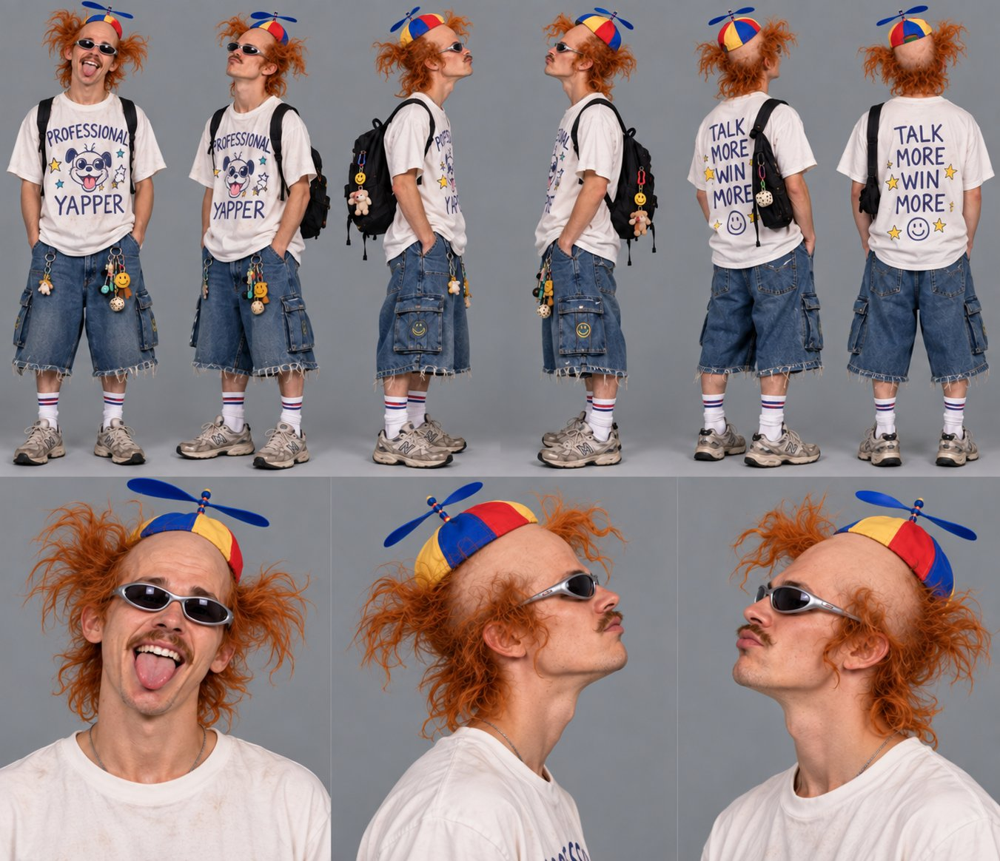 螺旋桨帽 + 标语 T：一件单品讲完人设 | 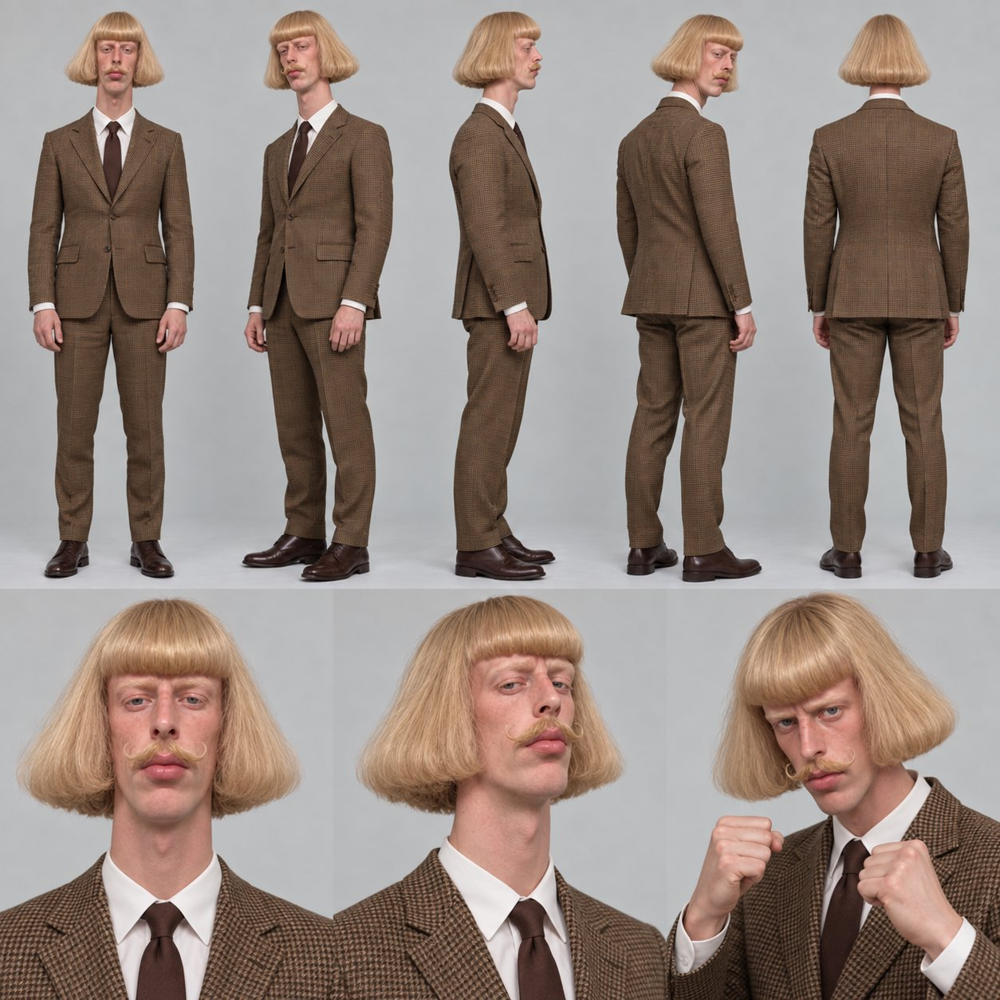 金色波波头 + 细格子西装 |
| 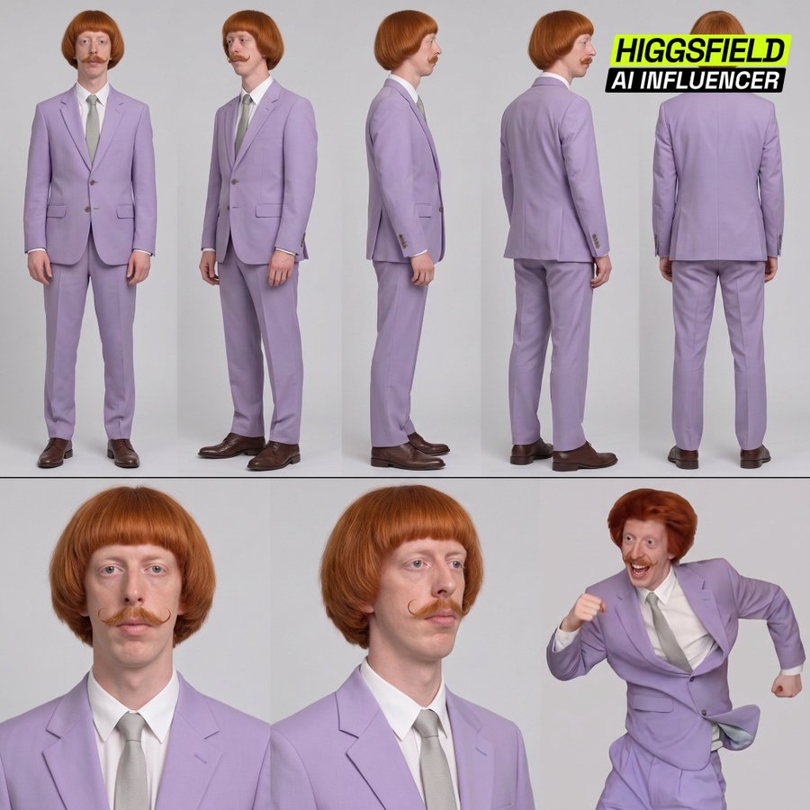 薰衣草西装 + 姜色碗盖头 + 翘胡 | 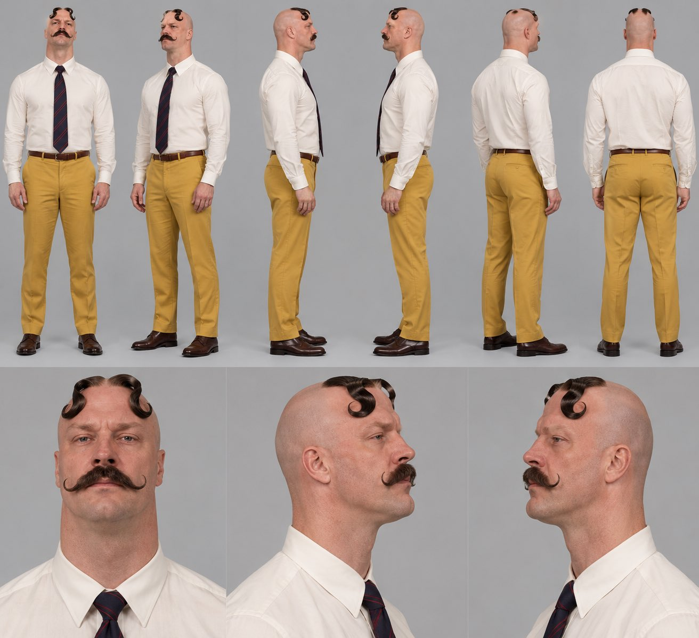 光头两绺卷 + 大八字胡：极简强记忆 | 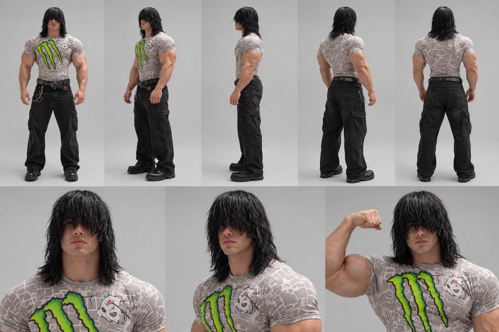 遮眼长发 + 肌肉体型反差 |
| 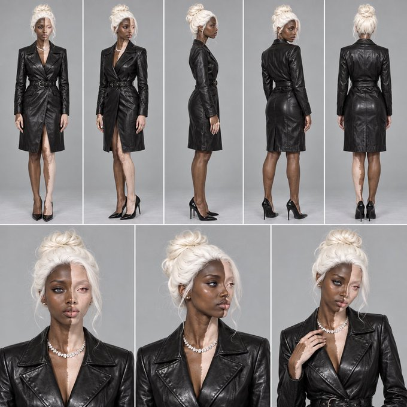 银白盘发 + 黑皮大衣：冷感权威 | | |

**共同规律**（正是本 skill 的设计信条）：一个夸张招牌发型 + 一个突出特征 +
老派真诚着装 + 面无表情；全身 5 视角 + 特写 3 视角的版式统一。

### 全身定妆图对标（9:16，灰/白纯色背景棚拍）

| | | | |
|---|---|---|---|
| 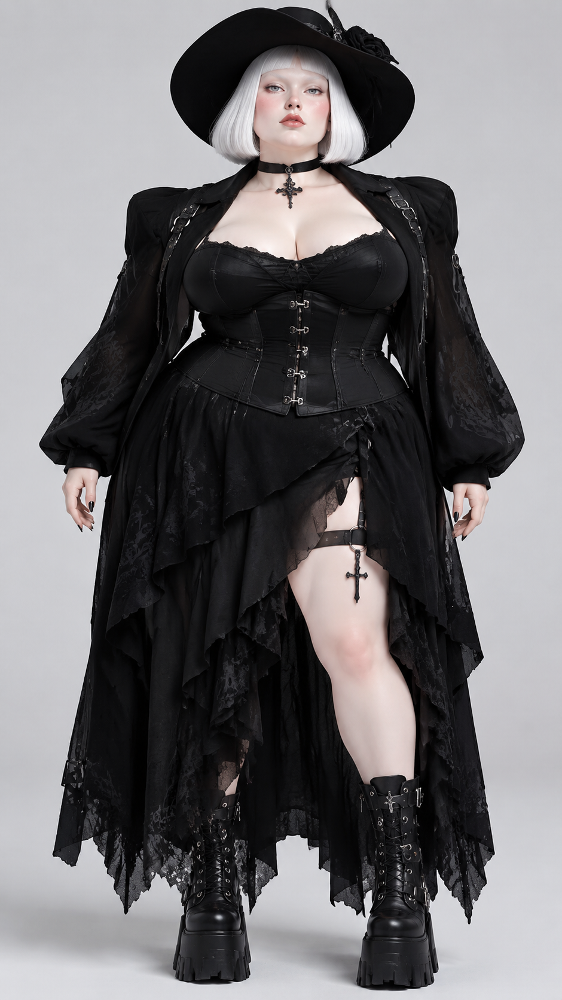 哥特洛丽塔：全黑 + 十字架 + 厚底靴 | 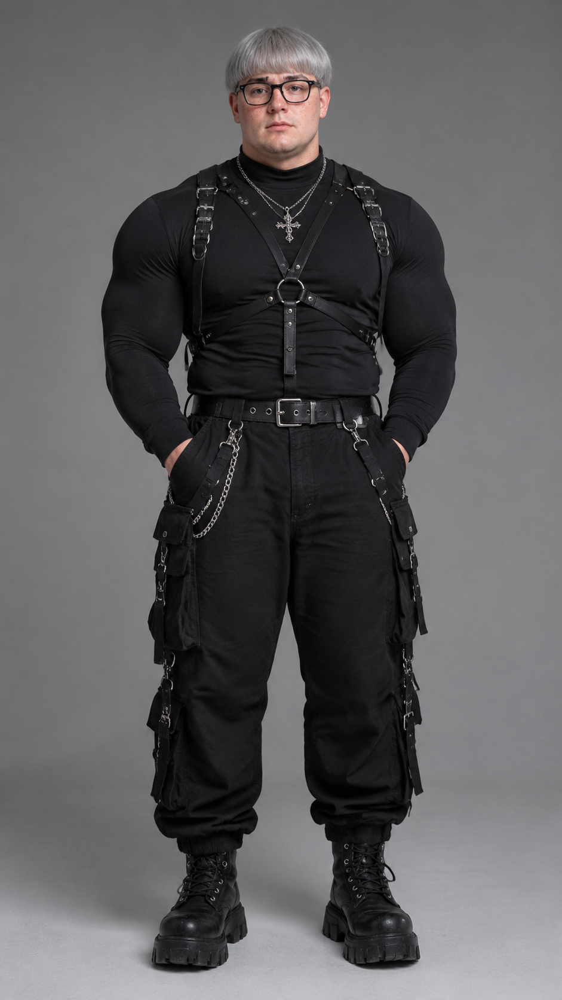 银灰短发 + 全黑机能束带 | 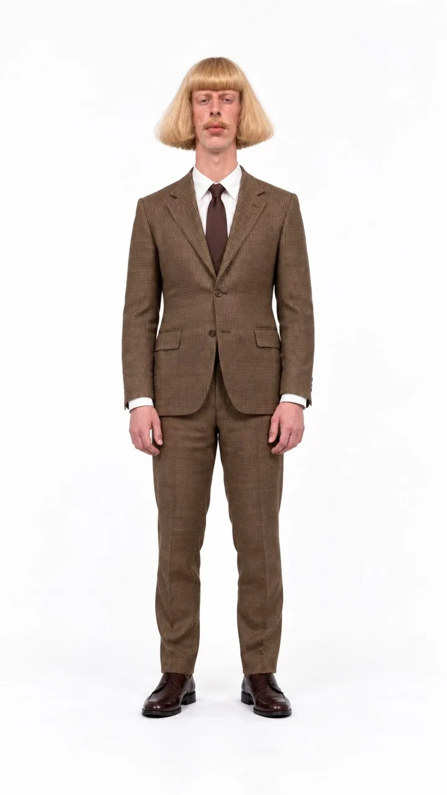 金色波波头 + 棕格西装 | 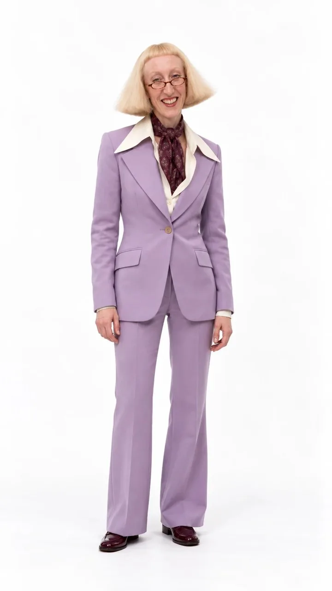 薰衣草喇叭裤套装 + 领巾 |
| 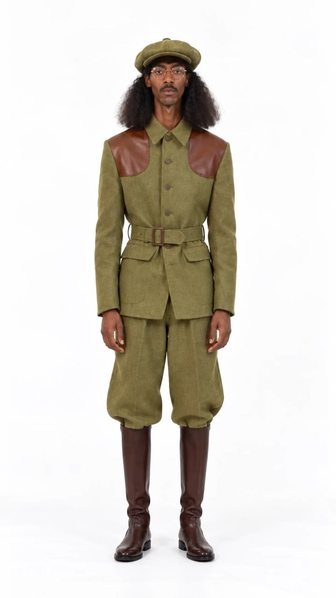 猎装卡其 + 贝雷帽 + 皮马靴 | 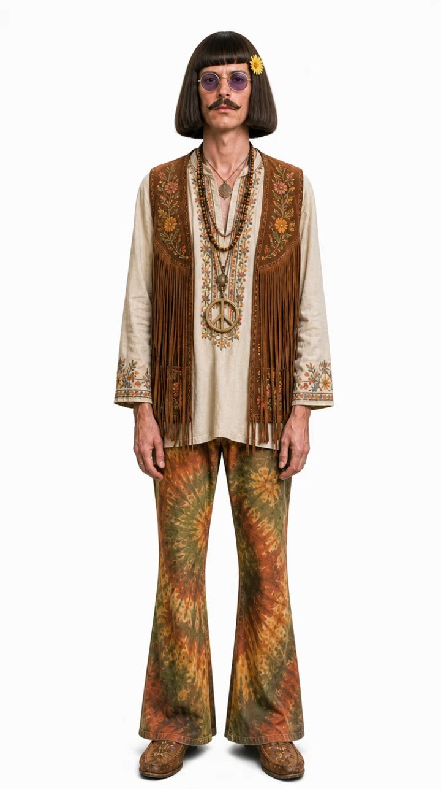 嬉皮流苏背心 + 和平符 + 扎染喇叭裤 | | |

---

## 元素画廊 · `taxonomy.md`

170 个形象选项的完整单图索引，由 `scripts/build_gallery.py` 从
`assets/index.json` 自动生成——**不要手改**，改数据后重新生成。

👉 [taxonomy.md](taxonomy.md)
