# 元素画廊 · Taxonomy Gallery

> 自动生成 · `python3 scripts/build_gallery.py` · 共 170 个元素 · 每个元素一张独立单图（禁止拼图，与运行时规则一致）

| 类目 | 选项数 |
|---|---|
| [Gender `gender`](#gender) | 5 |
| [Ethnicity `ethnicity_origin_base`](#ethnicity_origin_base) | 6 |
| [Age `age`](#age) | 3 |
| [Skin color `skin_tone`](#skin_tone) | 8 |
| [Height `height`](#height) | 3 |
| [Build `body_type`](#body_type) | 6 |
| [Proportions `proportions`](#proportions) | 6 |
| [Head shape `freak_head`](#freak_head) | 10 |
| [Neck `freak_neck`](#freak_neck) | 4 |
| [Eye shape `eye_shape`](#eye_shape) | 11 |
| [Eye color `eye_color`](#eye_color) | 8 |
| [Features `freak_face`](#freak_face) | 25 |
| [Facial hair `facial_hair`](#facial_hair) | 8 |
| [Hairstyle `hair`](#hair) | 26 |
| [Hair Color `hair_colour`](#hair_colour) | 13 |
| [Distinctive features `distinctive`](#distinctive) | 14 |
| [Style `aesthetic`](#aesthetic) | 8 |
| [Accessories `accessory`](#accessory) | 6 |

## Gender `gender` · 性别

| 图 | id | 名称 | 档位 |
|---|---|---|---|
| 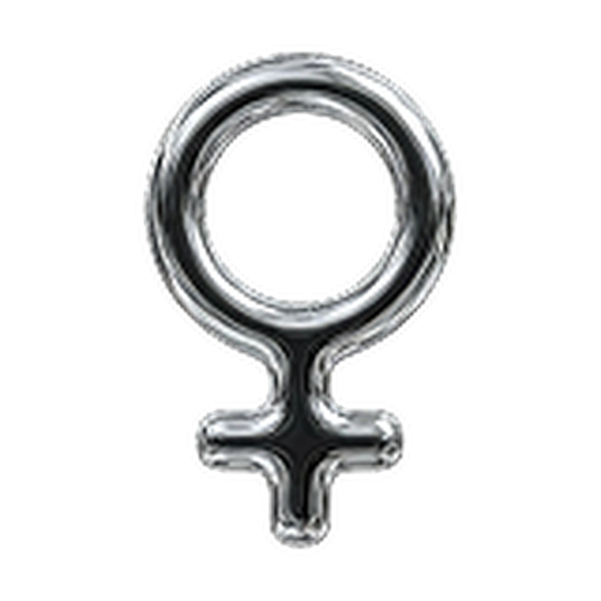 | `female` | Female / 女性 | Average · Bold · Extreme |
| 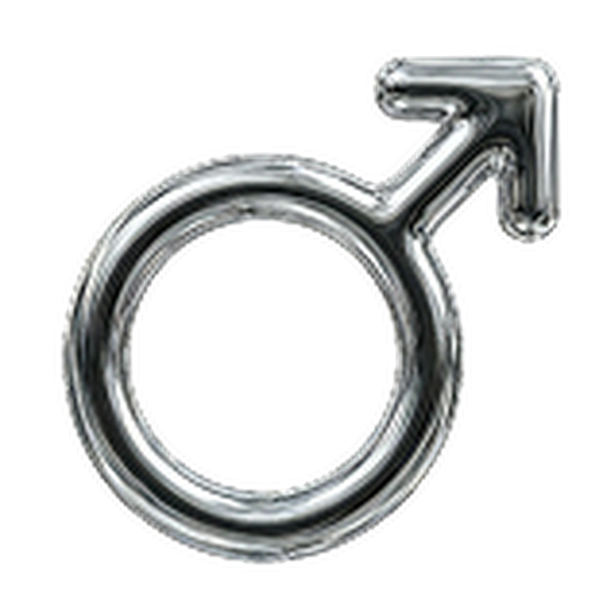 | `male` | Male / 男性 | Average · Bold · Extreme |
| 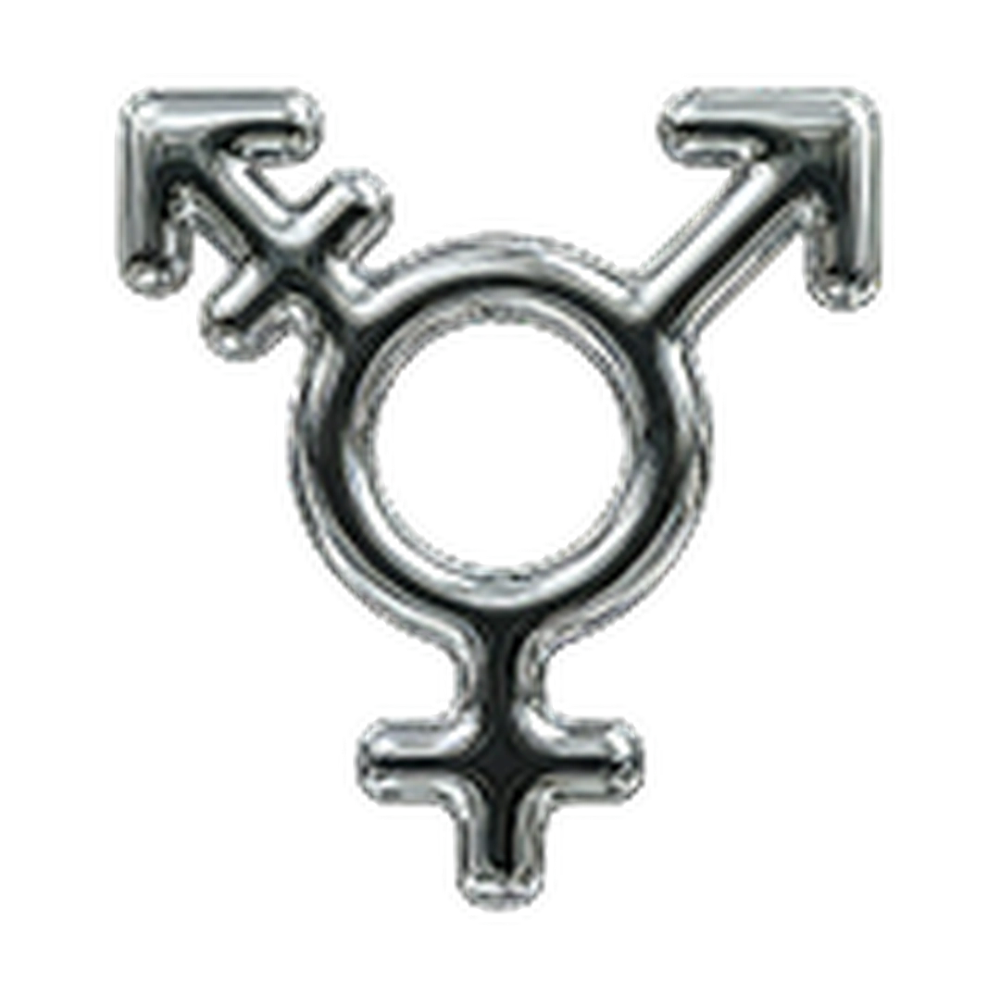 | `trans_man` | Trans man / 跨性别男性 | Average · Bold · Extreme |
|  | `trans_woman` | Trans woman / 跨性别女性 | Average · Bold · Extreme |
| 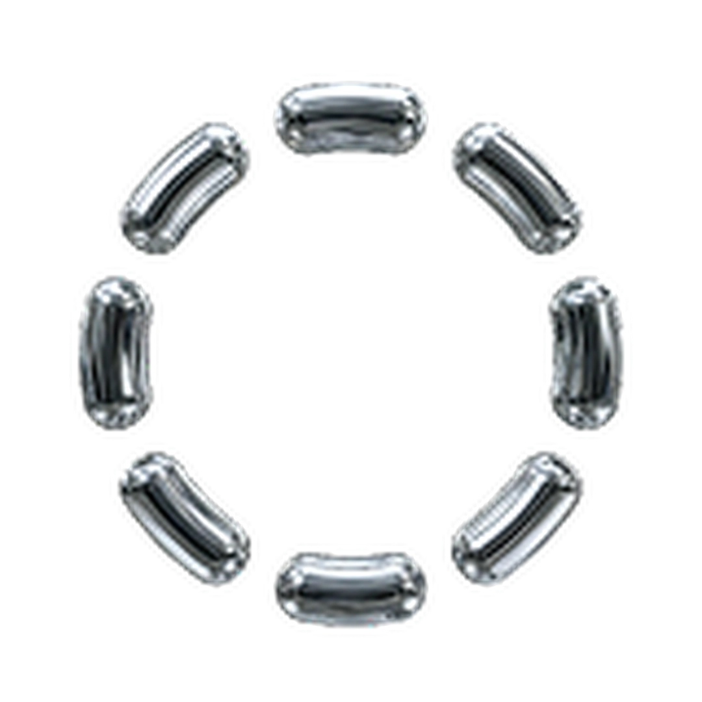 | `non_binary` | Non-binary / 非二元 | Average · Bold · Extreme |

## Ethnicity `ethnicity_origin_base` · 族裔

| 图 | id | 名称 | 档位 |
|---|---|---|---|
| 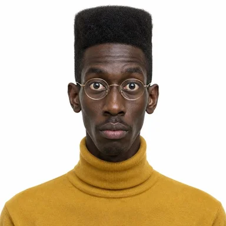 | `african` | African / 非洲裔 | Average · Bold · Extreme |
| 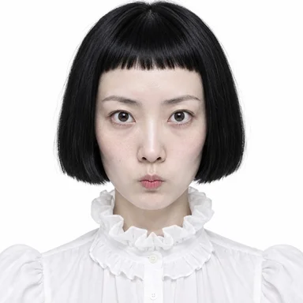 | `east_asian` | Asian / 东亚裔 | Average · Bold · Extreme |
| 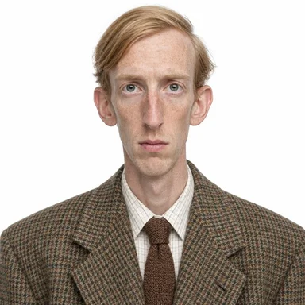 | `european` | European / 欧洲裔 | Average · Bold · Extreme |
| 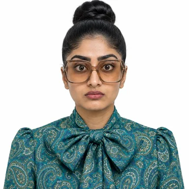 | `indian` | Indian / 南亚裔 | Average · Bold · Extreme |
| 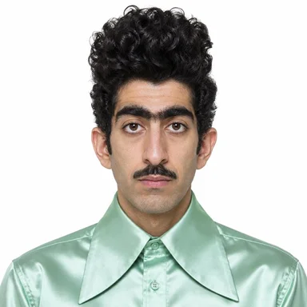 | `middle_eastern` | Middle Eastern / 中东裔 | Average · Bold · Extreme |
| 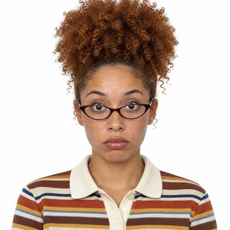 | `latin_american` | Mixed / 拉美混血 | Average · Bold · Extreme |

## Age `age` · 年龄

| 图 | id | 名称 | 档位 |
|---|---|---|---|
|  | `adult` | Adult / 青年 | Average · Bold · Extreme |
| 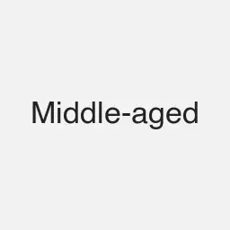 | `mature` | Mature / 中年 | Average · Bold · Extreme |
|  | `senior` | Senior / 老年 | Average · Bold · Extreme |

## Skin color `skin_tone` · 肤色

| 图 | id | 名称 | 档位 |
|---|---|---|---|
| 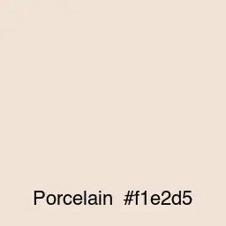 | `st_porcelain` | Porcelain / 瓷白 | Average · Bold · Extreme |
| 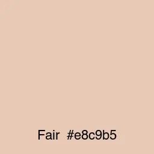 | `st_fair` | Fair / 白皙 | Average · Bold · Extreme |
| 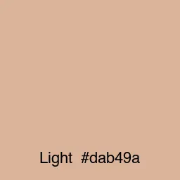 | `st_light` | Light / 浅肤 | Average · Bold · Extreme |
| 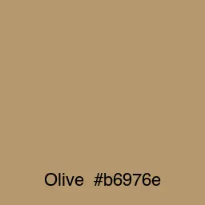 | `st_olive` | Olive / 橄榄 | Average · Bold · Extreme |
| 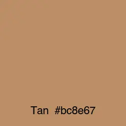 | `st_tan` | Tan / 小麦 | Average · Bold · Extreme |
| 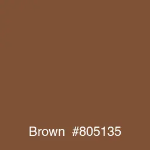 | `st_brown` | Brown / 棕色 | Average · Bold · Extreme |
| 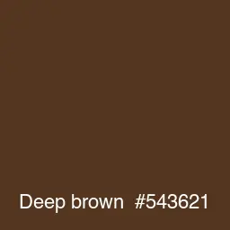 | `st_deep` | Deep brown / 深棕 | Average · Bold · Extreme |
| 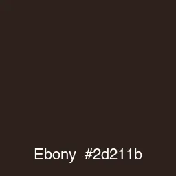 | `st_ebony` | Ebony / 乌木 | Average · Bold · Extreme |

## Height `height` · 身高

| 图 | id | 名称 | 档位 |
|---|---|---|---|
| 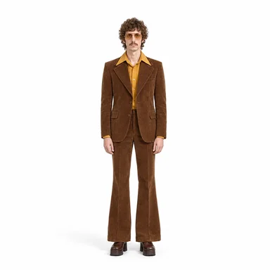 | `h_average` | Average / 中等身高 | Average · Bold · Extreme |
| 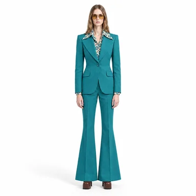 | `h_tall` | Tall / 高个 | Average · Bold · Extreme |
| 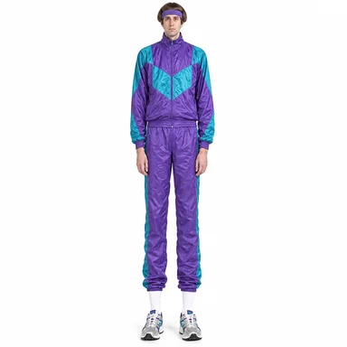 | `h_very_tall` | Very tall / 超高个 | Average · Bold · Extreme |

## Build `body_type` · 体型

| 图 | id | 名称 | 档位 |
|---|---|---|---|
| 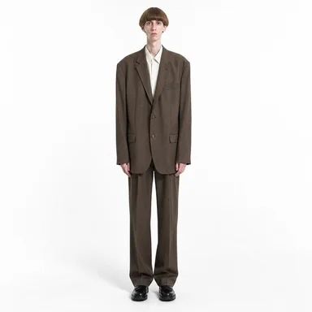 | `body_slim` | Slim / 纤瘦 | Average · Bold · Extreme |
| 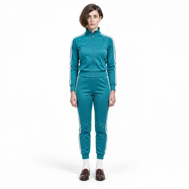 | `body_athletic` | Athletic / 运动型 | Average · Bold · Extreme |
| 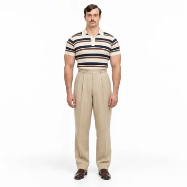 | `body_muscular` | Muscular / 肌肉型 | Average · Bold · Extreme |
| 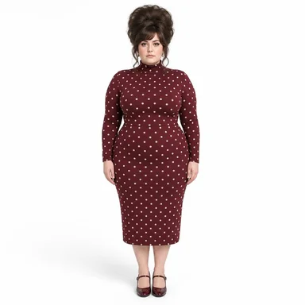 | `body_curvy` | Curvy / 曲线型 | Average · Bold · Extreme |
| 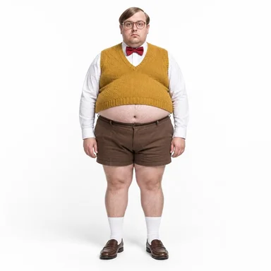 | `body_heavy` | Heavy / 壮硕圆润 | Average · Bold · Extreme |
| 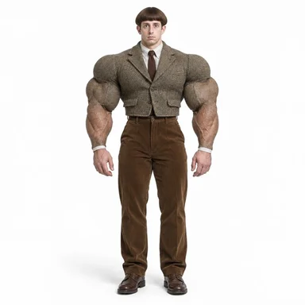 | `body_ultra` | Ultra Muscular / 夸张巨肌 | Average · Bold · Extreme |

## Proportions `proportions` · 身材比例

| 图 | id | 名称 | 档位 |
|---|---|---|---|
| 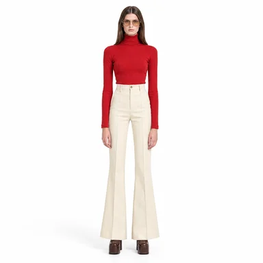 | `pr_longlimbs` | Long limbs / 超长四肢 | Average · Bold · Extreme |
| 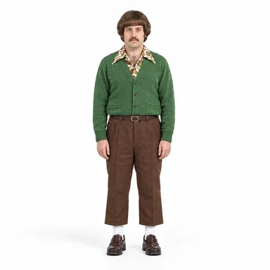 | `pr_shortlegs` | Short legs / 短腿 | Average · Bold · Extreme |
| 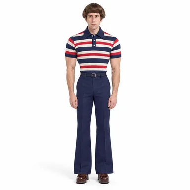 | `pr_shoulders` | Broad shoulders / 宽肩 | Average · Bold · Extreme |
| 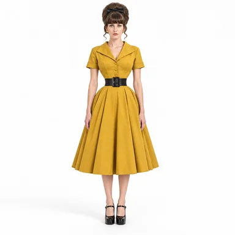 | `pr_waist` | Tiny waist / 细腰 | Average · Bold · Extreme |
| 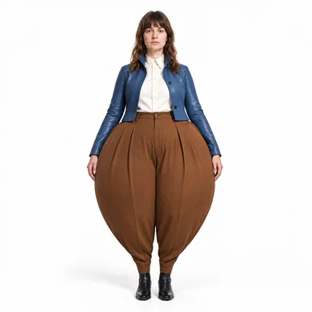 | `pr_egg` | Egg body / 蛋形身材 ★ | Bold · Extreme |
| 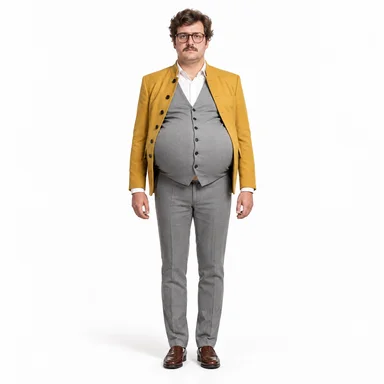 | `pr_potbelly` | Pot belly / 啤酒肚 ★ | Bold · Extreme |

## Head shape `freak_head` · 头型脸型

| 图 | id | 名称 | 档位 |
|---|---|---|---|
| 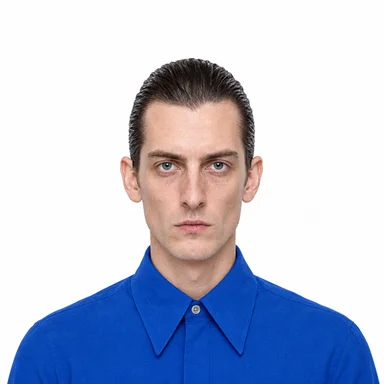 | `head_oval` | Standard / 鹅蛋脸 | Average · Bold · Extreme |
| 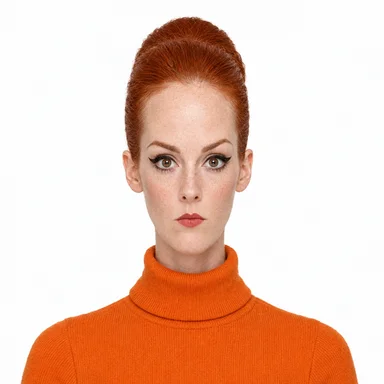 | `head_long` | Long / 长脸 | Average · Bold · Extreme |
| 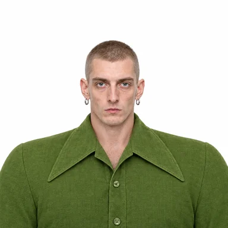 | `head_tiny` | Tiny / 迷你小头 ★ | Bold · Extreme |
| 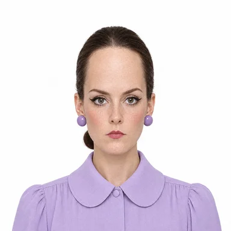 | `head_forehead` | High forehead / 高额头 ★ | Bold · Extreme |
| 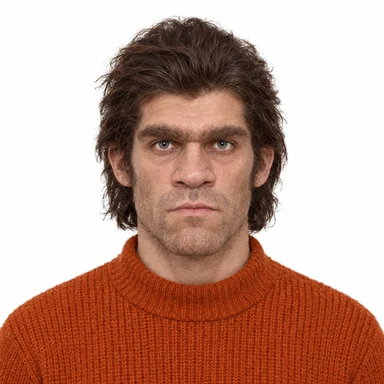 | `head_ancient` | Caveman / 原始人头型 ★ | Extreme |
| 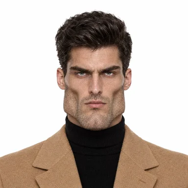 | `head_herojaw` | Gigachad / 英雄下颌 ★ | Extreme |
|  | `head_megachin` | Mega jaw / 超大下巴 ★ | Extreme |
| 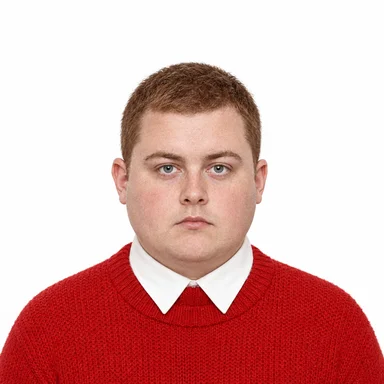 | `head_round` | Round / 圆脸 | Average · Bold · Extreme |
| 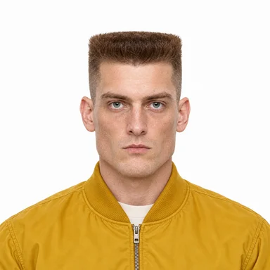 | `head_square` | Square / 方脸 | Average · Bold · Extreme |
| 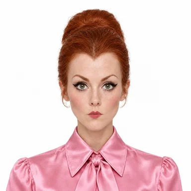 | `head_heart` | Heart / 心形脸 | Average · Bold · Extreme |

## Neck `freak_neck` · 脖子

| 图 | id | 名称 | 档位 |
|---|---|---|---|
| 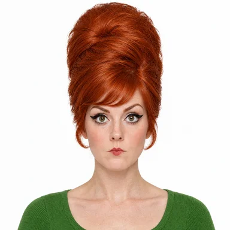 | `neck_normal` | Standard / 正常脖子 | Average · Bold · Extreme |
| 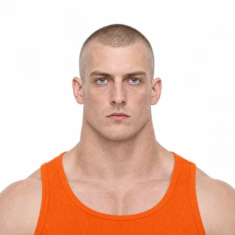 | `neck_column` | Column / 柱状粗脖 ★ | Bold · Extreme |
| 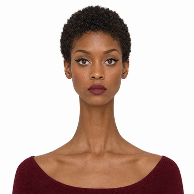 | `neck_long` | Long / 天鹅长颈 ★ | Bold · Extreme |
| 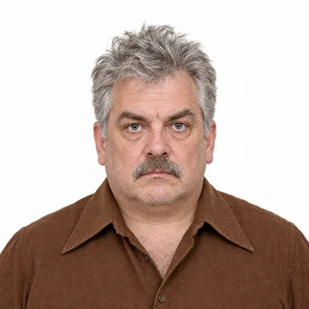 | `neck_short` | Short / 短脖 | Average · Bold · Extreme |

## Eye shape `eye_shape` · 眼型

| 图 | id | 名称 | 档位 |
|---|---|---|---|
| 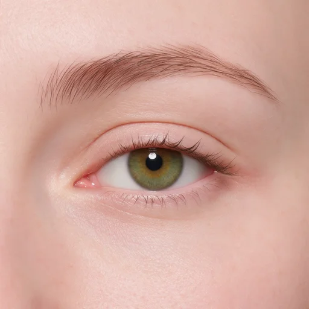 | `es_almond` | Almond / 杏眼 | Average · Bold · Extreme |
| 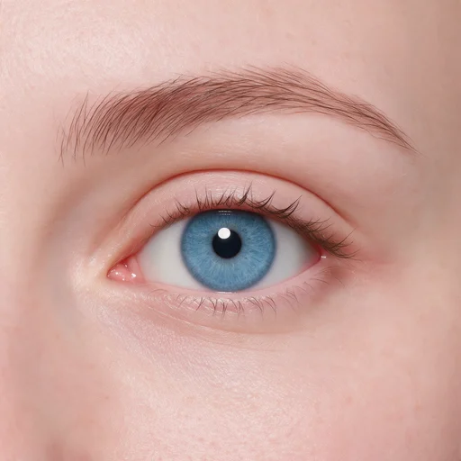 | `es_round` | Round / 圆眼 | Average · Bold · Extreme |
| 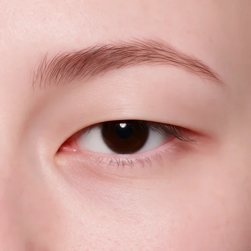 | `es_monolid` | Monolid / 单眼皮 | Average · Bold · Extreme |
| 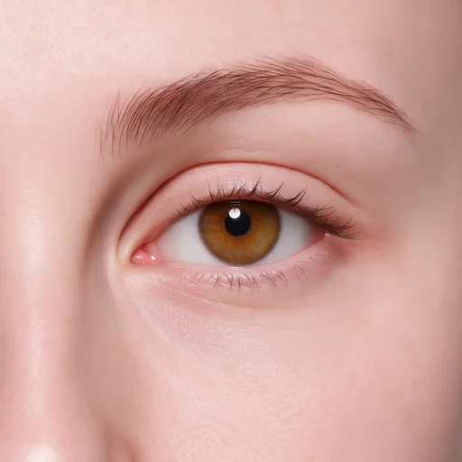 | `es_close` | Close-set / 眼距窄 ★ | Bold · Extreme |
| 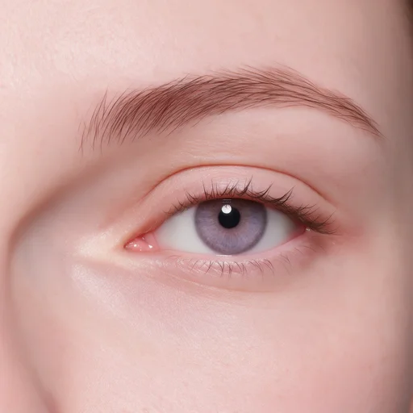 | `es_wide` | Wide-set / 眼距宽 ★ | Bold · Extreme |
| 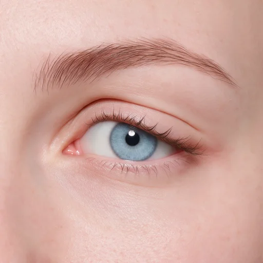 | `es_uneven` | Uneven / 大小眼 ★ | Bold · Extreme |
| 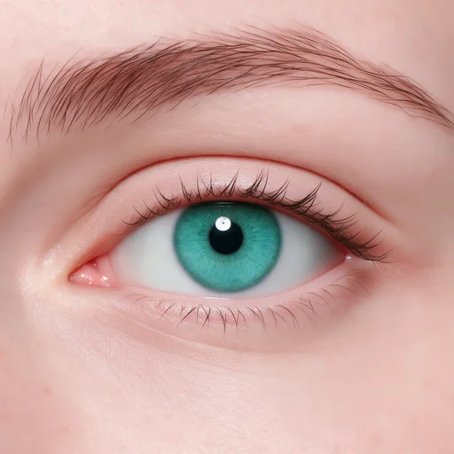 | `es_large` | Large / 大眼 | Average · Bold · Extreme |
| 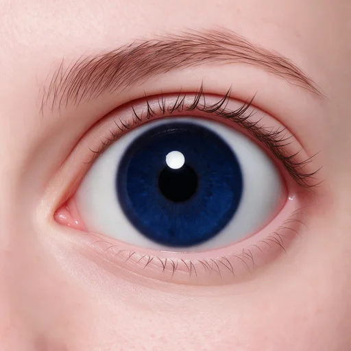 | `es_huge` | Huge / 巨型卡通眼 ★ | Bold · Extreme |
| 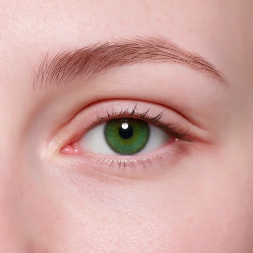 | `es_hooded` | Hooded / 肿眼泡 | Average · Bold · Extreme |
| 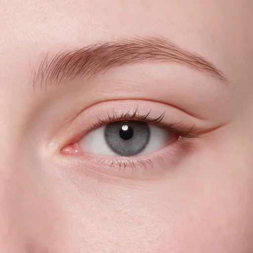 | `es_upturned` | Upturned / 上挑猫眼 | Average · Bold · Extreme |
| 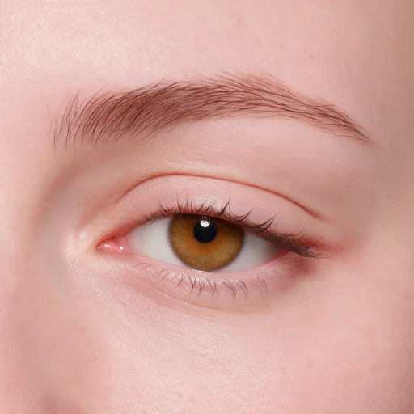 | `es_downturned` | Downturned / 下垂眼 | Average · Bold · Extreme |

## Eye color `eye_color` · 瞳色

| 图 | id | 名称 | 档位 |
|---|---|---|---|
| 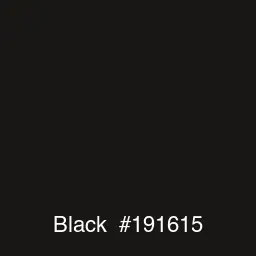 | `eye_black` | Black / 黑瞳 | Average · Bold · Extreme |
| 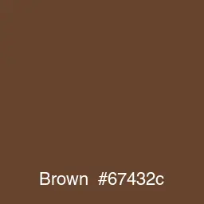 | `eye_brown` | Brown / 棕瞳 | Average · Bold · Extreme |
| 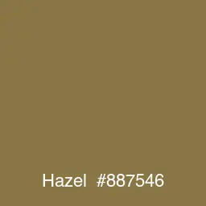 | `eye_hazel` | Hazel / 榛色瞳 | Average · Bold · Extreme |
| 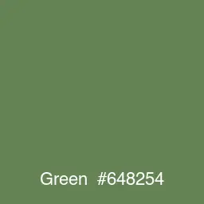 | `eye_green` | Green / 绿瞳 | Average · Bold · Extreme |
| 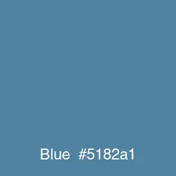 | `eye_blue` | Blue / 蓝瞳 | Average · Bold · Extreme |
| 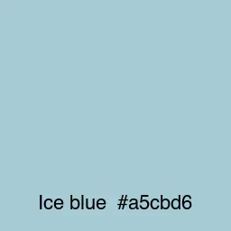 | `eye_ice_blue` | Ice blue / 冰蓝瞳 | Average · Bold · Extreme |
| 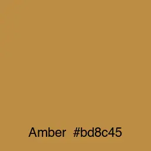 | `eye_amber` | Amber / 琥珀瞳 | Average · Bold · Extreme |
| 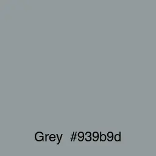 | `eye_grey` | Grey / 灰瞳 | Average · Bold · Extreme |

## Features `freak_face` · 面部特征

| 图 | id | 名称 | 档位 |
|---|---|---|---|
| 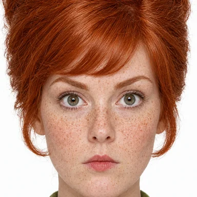 | `fn_freckles` | Freckles / 雀斑 | Average · Bold · Extreme |
| 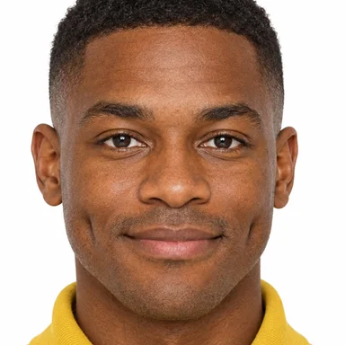 | `fn_dimples` | Dimples / 酒窝 | Average · Bold · Extreme |
| 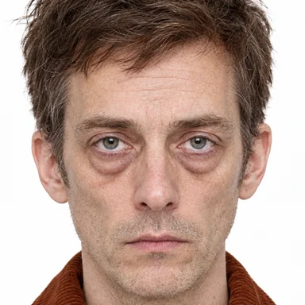 | `fn_eyebags` | Heavy eye bags / 重眼袋 | Average · Bold · Extreme |
| 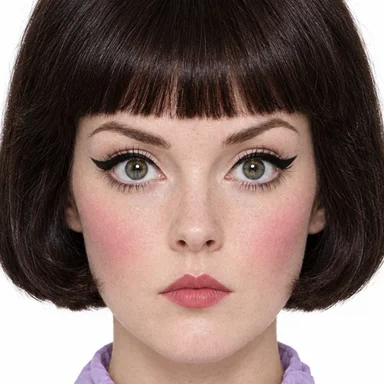 | `ff_marks_12` | Blush / 娃娃腮红 ★ | Bold · Extreme |
| 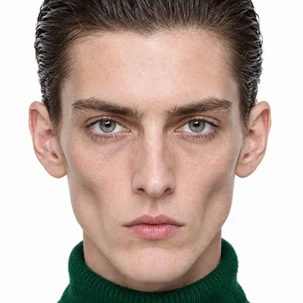 | `fn_cheekbones` | High cheekbones / 高颧骨 | Average · Bold · Extreme |
| 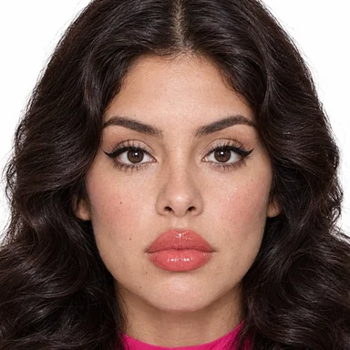 | `fn_fulllips` | Full lips / 丰唇 | Average · Bold · Extreme |
| 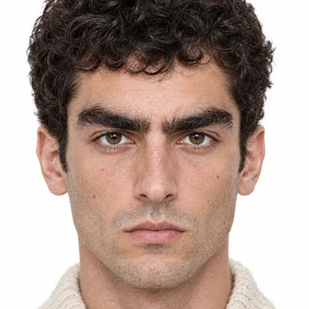 | `fn_thickbrows` | Thick brows / 浓眉 | Average · Bold · Extreme |
| 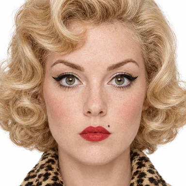 | `fn_mole` | Beauty mark / 美人痣 | Average · Bold · Extreme |
| 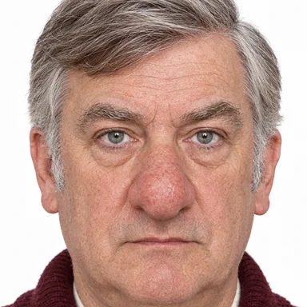 | `ff_nose_0` | Potato nose / 土豆鼻 ★ | Bold · Extreme |
|  | `ff_nose_1` | Button nose / 朝天小鼻 ★ | Bold · Extreme |
| 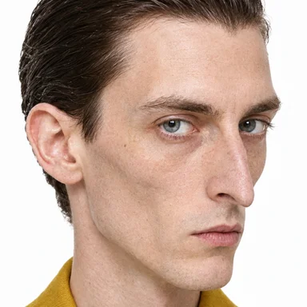 | `ff_nose_2` | Long pointy nose / 尖长鼻 ★ | Bold · Extreme |
| 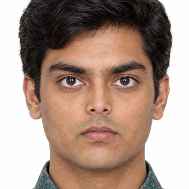 | `fn_tinynose` | Tiny nose / 小巧鼻 | Average · Bold · Extreme |
| 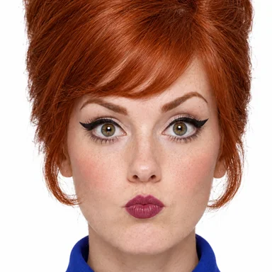 | `ff_lips_3` | Pouty lips / 嘟嘟唇 ★ | Bold · Extreme |
| 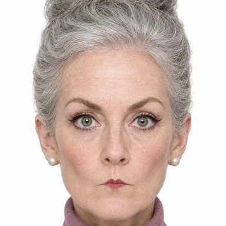 | `ff_lips_4` | Tiny pursed mouth / 樱桃小嘴 ★ | Bold · Extreme |
| 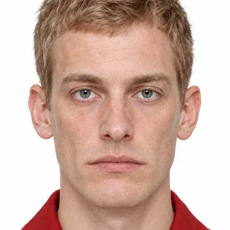 | `fn_widemouth` | Wide mouth / 阔嘴 | Average · Bold · Extreme |
| 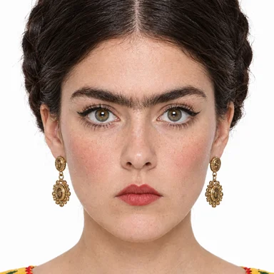 | `ff_brows_5` | Unibrow / 一字连眉 ★ | Bold · Extreme |
| 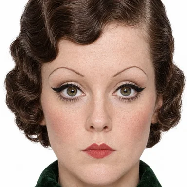 | `ff_brows_6` | Thin high brows / 细挑高眉 ★ | Bold · Extreme |
| 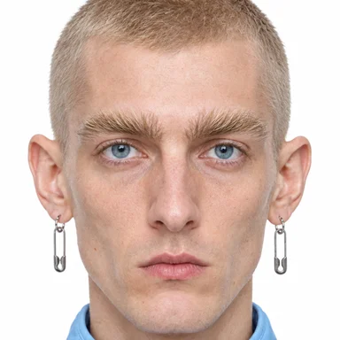 | `ff_brows_7` | Brush brows / 炸毛眉 ★ | Bold · Extreme |
| 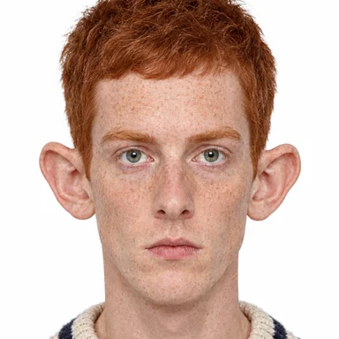 | `ff_ears_8` | Jug ears / 招风耳 ★ | Bold · Extreme |
|  | `ff_ears_9` | Uneven ears / 大小耳 ★ | Bold · Extreme |
| 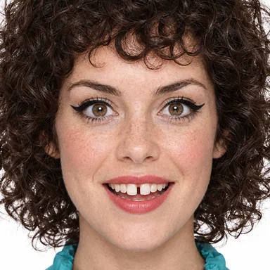 | `ff_teeth_10` | Gap teeth / 门牙缝 ★ | Bold · Extreme |
| 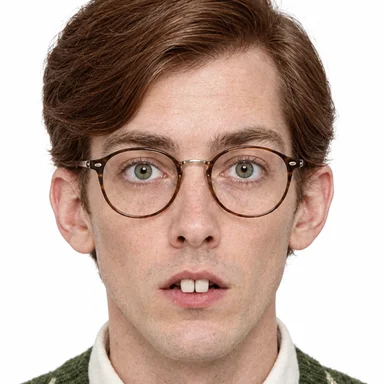 | `ff_teeth_11` | Buck teeth / 龅牙 ★ | Bold · Extreme |
| 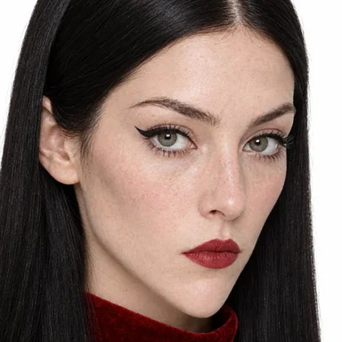 | `fn_pointychin` | Pointy chin / 尖下巴 | Average · Bold · Extreme |
| 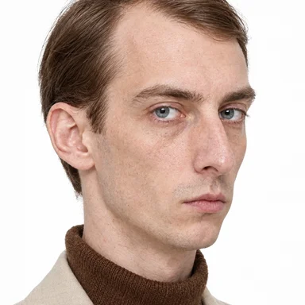 | `ff_chin_13` | Weak chin / 后缩下巴 ★ | Bold · Extreme |
| 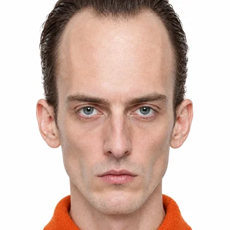 | `ff_forehead_14` | Big forehead / 大脑门 ★ | Bold · Extreme |

## Facial hair `facial_hair` · 胡须

| 图 | id | 名称 | 档位 |
|---|---|---|---|
| 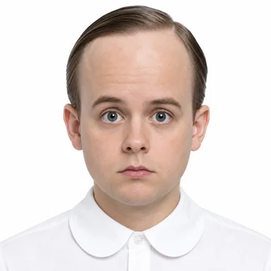 | `fh_none` | Clean-shaven / 无胡须 | Average · Bold · Extreme |
| 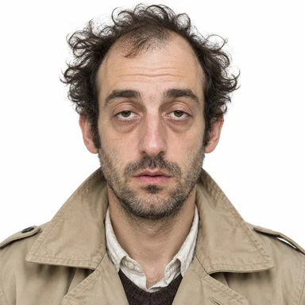 | `fh_stubble` | Stubble / 胡茬 | Average · Bold · Extreme |
| 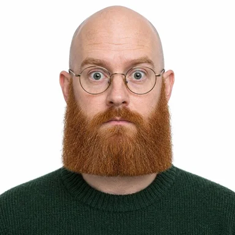 | `fh_beard` | Full beard / 络腮胡 | Average · Bold · Extreme |
| 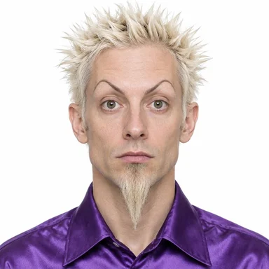 | `fh_goatee` | Goatee / 山羊胡 | Average · Bold · Extreme |
|  | `fh_moustache` | Moustache / 八字胡 | Average · Bold · Extreme |
|  | `fh_pencil` | Pencil moustache / 铅笔胡 | Average · Bold · Extreme |
| 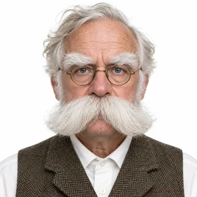 | `fh_pushbroom` | Push-broom moustache / 海象大胡 ★ | Bold · Extreme |
| 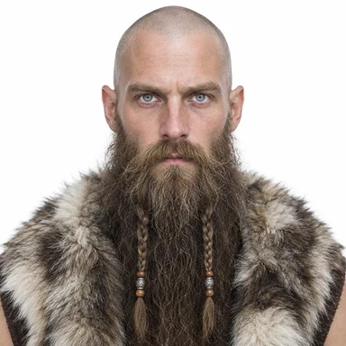 | `fh_braid` | Braided beard / 维京辫子胡 ★ | Bold · Extreme |

## Hairstyle `hair` · 发型

| 图 | id | 名称 | 档位 |
|---|---|---|---|
|  | `hs_lampshade` | Lampshade bob / 灯罩波波头 ★ | Bold · Extreme |
|  | `hair_bald` | Bald / 光头 | Average · Bold · Extreme |
| 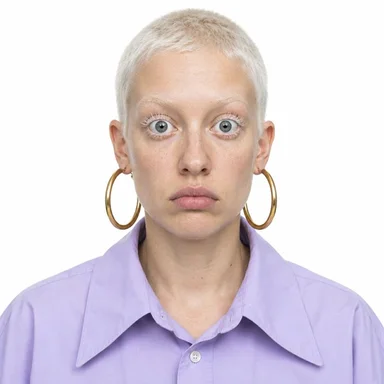 | `hair_buzz` | Buzz cut / 漂白寸头 | Average · Bold · Extreme |
| 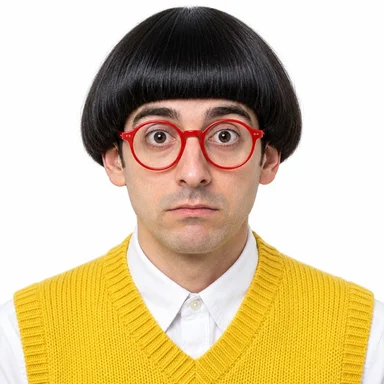 | `hair_bowl` | Bowl cut / 锅盖头 | Average · Bold · Extreme |
| 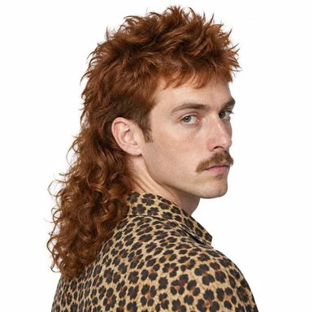 | `hair_mullet` | Mullet / 鲻鱼头 | Average · Bold · Extreme |
| 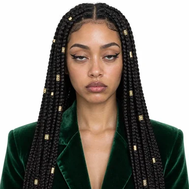 | `hair_braids` | Braids / 长脏辫 | Average · Bold · Extreme |
| 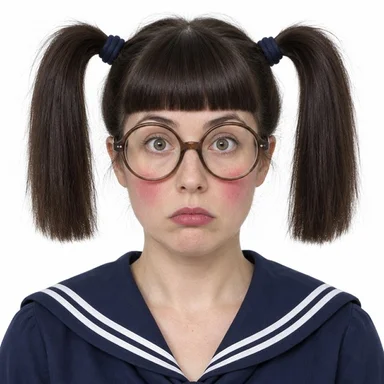 | `hair_pigtails` | Pigtails / 双马尾 | Average · Bold · Extreme |
| 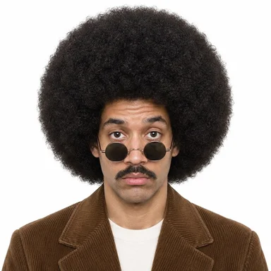 | `hair_afro` | Afro / 爆炸头 | Average · Bold · Extreme |
| 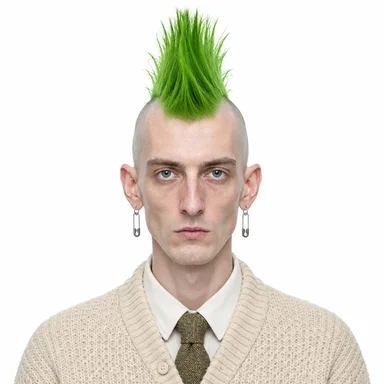 | `hair_punk` | Mohawk / 莫西干 | Average · Bold · Extreme |
| 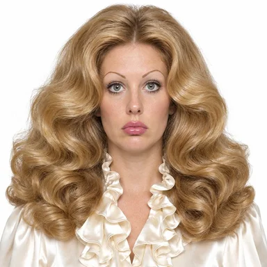 | `hs_pompadour` | Volume waves / 70s 大波浪 ★ | Bold · Extreme |
|  | `hs_beehive` | Beehive / 蜂巢高发髻 ★ | Bold · Extreme |
| 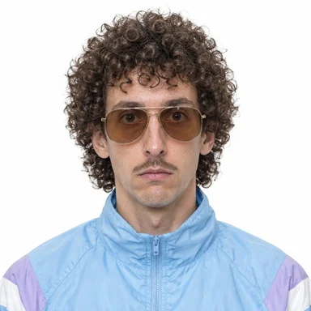 | `hs_dome` | Perm / 小卷烫 ★ | Bold · Extreme |
| 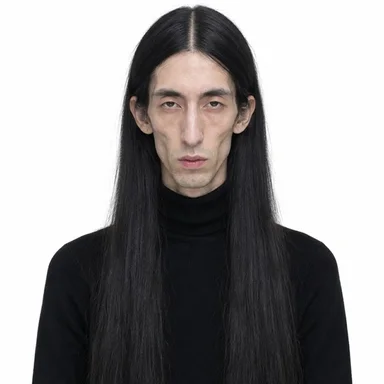 | `hair_long` | Long hair / 超长直发 | Average · Bold · Extreme |
| 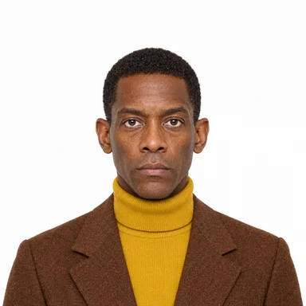 | `hair_short` | Short hair / 利落短发 | Average · Bold · Extreme |
|  | `hs_horns` | Hair horns / 恶魔角发型 ★ | Bold · Extreme |
|  | `hs_softserve` | Soft-serve swirl / 软冰淇淋盘发 ★ | Bold · Extreme |
|  | `hs_sphere` | Curl sphere / 巨型卷发球 ★ | Bold · Extreme |
| 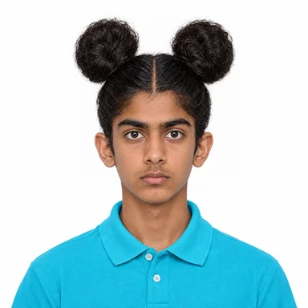 | `hs_mouse` | Mouse-ear puffs / 米老鼠双丸子 ★ | Bold · Extreme |
| 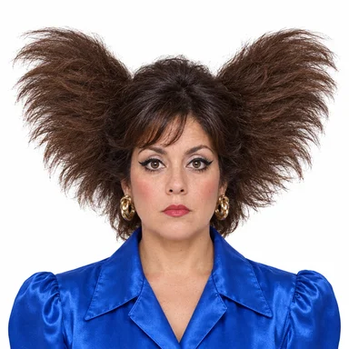 | `hs_wings` | Hair wings / 炸毛翅膀头 ★ | Bold · Extreme |
| 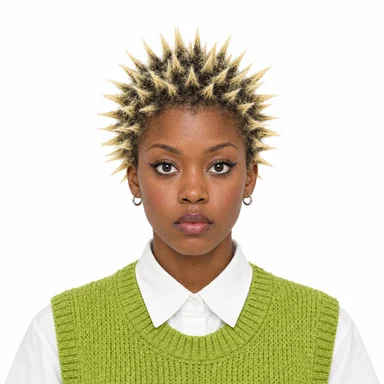 | `hs_hedgehog` | Hedgehog spikes / 刺猬头 ★ | Bold · Extreme |
| 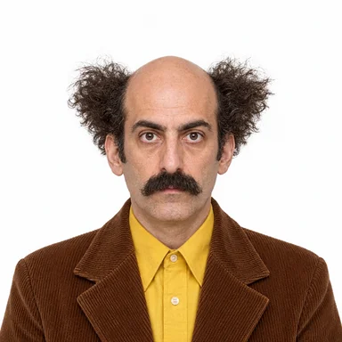 | `hs_tufts` | Bald + side tufts / 地中海两撮毛 ★ | Bold · Extreme |
|  | `hs_stairs` | Stair steps / 楼梯平头 ★ | Bold · Extreme |
| 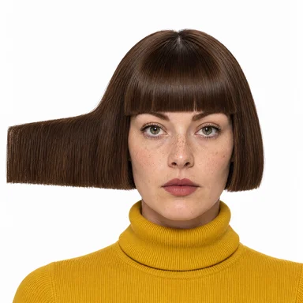 | `hs_shelf` | Shelf bob / 置物架波波 ★ | Bold · Extreme |
| 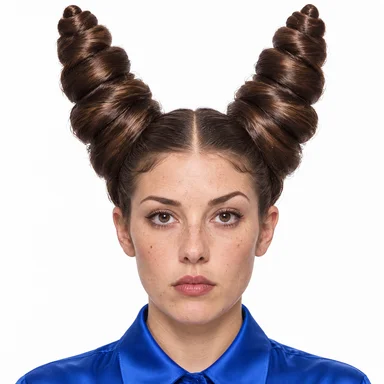 | `hs_corkscrews` | Twin corkscrews / 双螺旋角 ★ | Bold · Extreme |
| 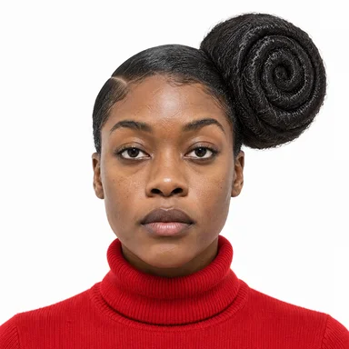 | `hs_sidecoil` | Side coil / 单侧盘卷 ★ | Bold · Extreme |
| 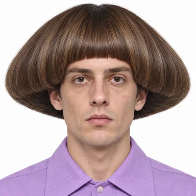 | `hs_mushroom` | Mushroom bowl / 蘑菇头 ★ | Bold · Extreme |

## Hair Color `hair_colour` · 发色

| 图 | id | 名称 | 档位 |
|---|---|---|---|
| 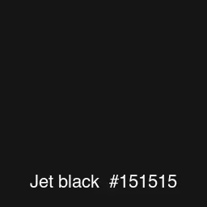 | `hc_black` | Jet black / 乌黑 | Average · Bold · Extreme |
| 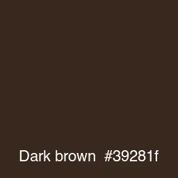 | `hc_darkbrown` | Dark brown / 深棕 | Average · Bold · Extreme |
| 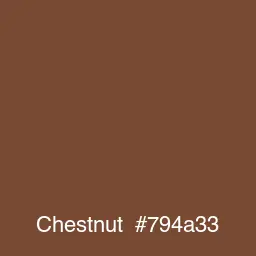 | `hc_chestnut` | Chestnut / 栗色 | Average · Bold · Extreme |
| 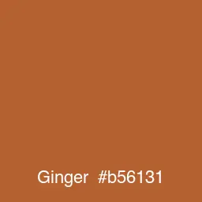 | `hc_ginger` | Ginger / 姜黄 | Average · Bold · Extreme |
| 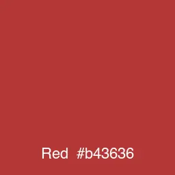 | `hc_red` | Red / 红色 | Average · Bold · Extreme |
| 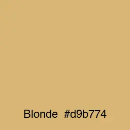 | `hc_blonde` | Blonde / 金色 | Average · Bold · Extreme |
| 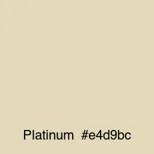 | `hc_platinum` | Platinum / 铂金 | Average · Bold · Extreme |
| 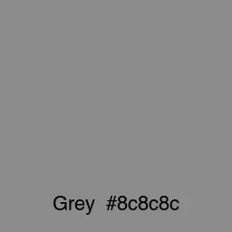 | `hc_grey` | Grey / 灰发 | Average · Bold · Extreme |
| 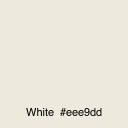 | `hc_white` | White / 白发 | Average · Bold · Extreme |
| 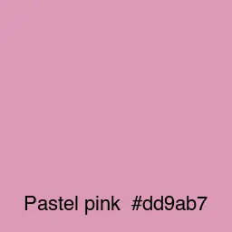 | `hc_pink` | Pastel pink / 粉色 | Average · Bold · Extreme |
| 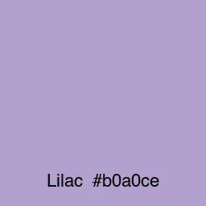 | `hc_lilac` | Lilac / 淡紫 | Average · Bold · Extreme |
| 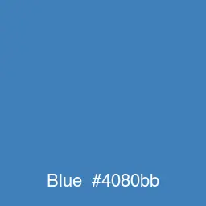 | `hc_blue` | Blue / 蓝色 | Average · Bold · Extreme |
| 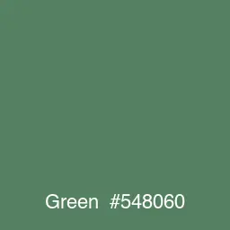 | `hc_green` | Green / 绿色 | Average · Bold · Extreme |

## Distinctive features `distinctive` · 标志性细节

| 图 | id | 名称 | 档位 |
|---|---|---|---|
|  | `df_hetero` | Odd eyes / 异色瞳 | Average · Bold · Extreme |
| 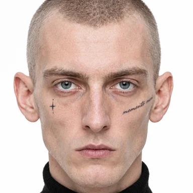 | `df_facetattoo` | Face tattoo / 面部纹身 | Average · Bold · Extreme |
| 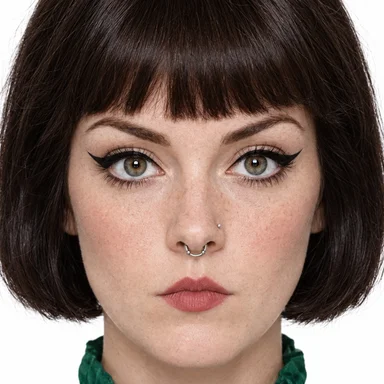 | `df_septum` | Piercing / 鼻中隔环 | Average · Bold · Extreme |
| 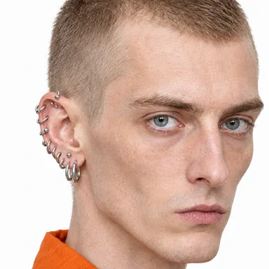 | `df_ears` | Stacked ear piercings / 满耳骨钉 | Average · Bold · Extreme |
| 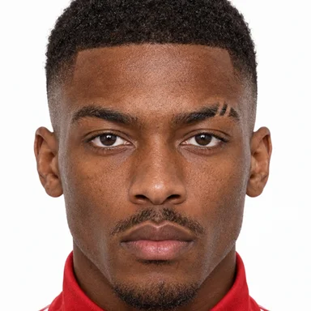 | `df_slits` | Brow slits / 断眉剃痕 | Average · Bold · Extreme |
| 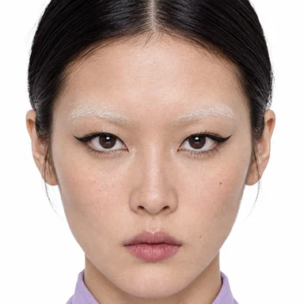 | `df_bleached` | Bleached / 漂白眉 | Average · Bold · Extreme |
| 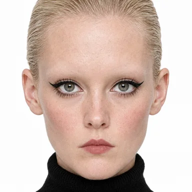 | `df_nobrows` | No brows / 无眉 | Average · Bold · Extreme |
| 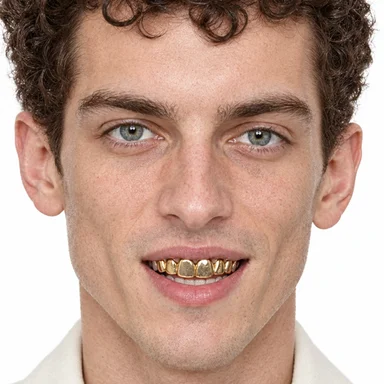 | `df_grill` | Gold grill / 金牙套 | Average · Bold · Extreme |
| 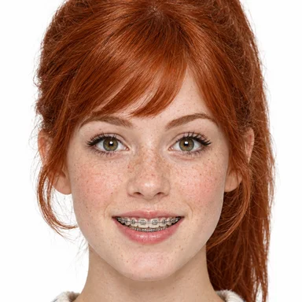 | `df_braces` | Braces / 牙套 | Average · Bold · Extreme |
| 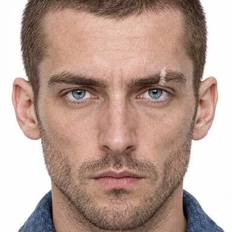 | `df_scar` | Brow scar / 眉骨疤痕 | Average · Bold · Extreme |
|  | `df_gems` | Face gems / 面部亮钻 | Average · Bold · Extreme |
| 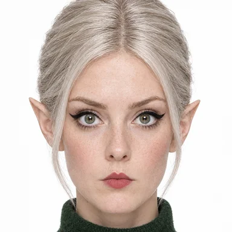 | `df_elf` | Elf ears / 精灵耳 | Average · Bold · Extreme |
| 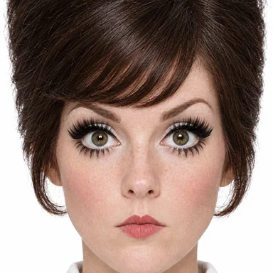 | `df_lashes` | Big lashes / 夸张假睫毛 | Average · Bold · Extreme |
| 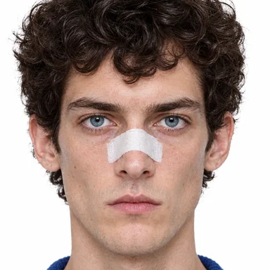 | `df_bandage` | Nose tape / 鼻贴 | Average · Bold · Extreme |

## Style `aesthetic` · 穿搭风格

| 图 | id | 名称 | 档位 |
|---|---|---|---|
| 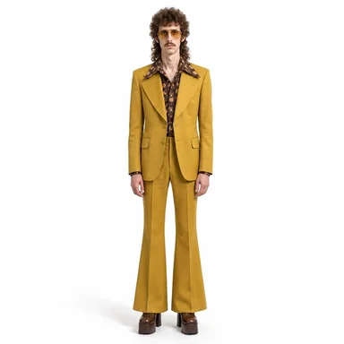 | `retro` | Retro / 70s 复古 | Average · Bold · Extreme |
| 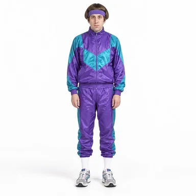 | `sporty` | Sporty / 90s 运动 | Average · Bold · Extreme |
|  | `y2k` | Y2K / 千禧 Y2K | Average · Bold · Extreme |
|  | `theatrical` | Theatre / 戏剧服装 | Average · Bold · Extreme |
| 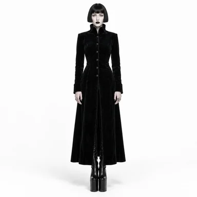 | `goth` | Goth / 暗黑哥特 | Average · Bold · Extreme |
| 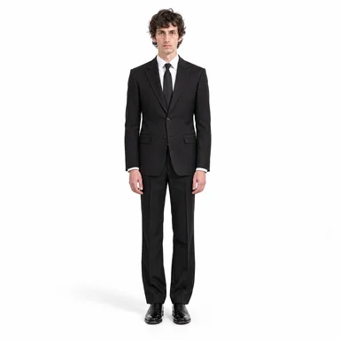 | `suits` | Suits / 一本正经西装 | Average · Bold · Extreme |
| 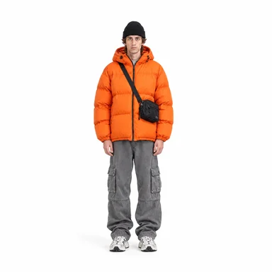 | `streetstyle` | Streetstyle / 街头潮流 | Average · Bold · Extreme |
| 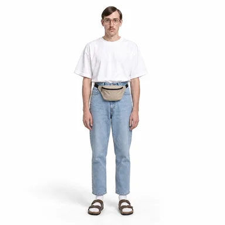 | `casual` | Casual / 日常休闲 | Average · Bold · Extreme |

## Accessories `accessory` · 配饰

| 图 | id | 名称 | 档位 |
|---|---|---|---|
|  | `acc_none` | None / 无配饰 | Average · Bold · Extreme |
| 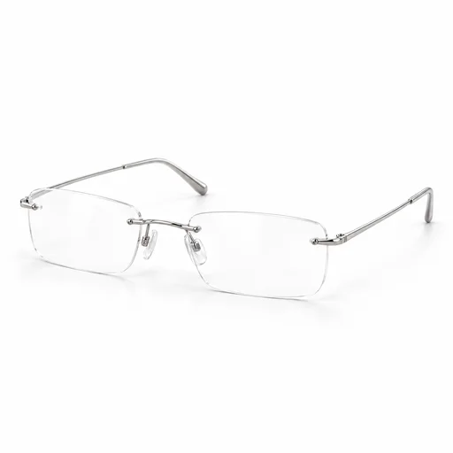 | `acc_glasses` | Glasses / 眼镜 | Average · Bold · Extreme |
| 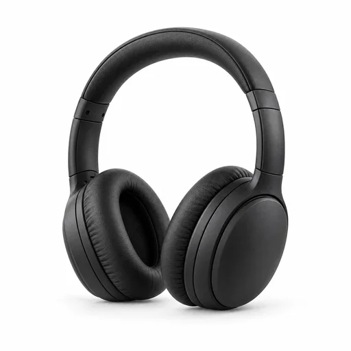 | `acc_headphones` | Headphones / 头戴耳机 | Average · Bold · Extreme |
| 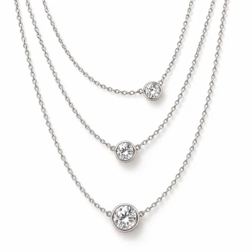 | `acc_jewelry` | Jewelry / 叠戴项链 | Average · Bold · Extreme |
| 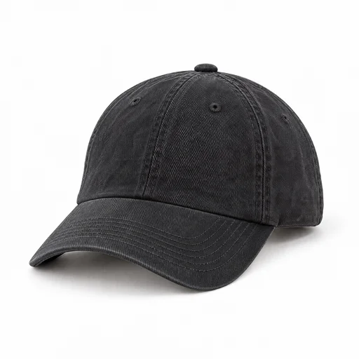 | `acc_hat` | Hat / 棒球帽 | Average · Bold · Extreme |
| 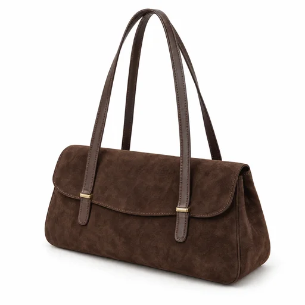 | `acc_bag` | Bag / 手提包 | Average · Bold · Extreme |
